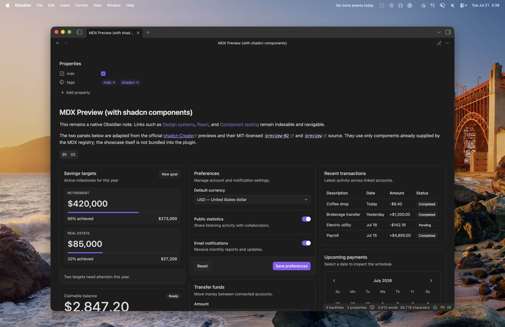
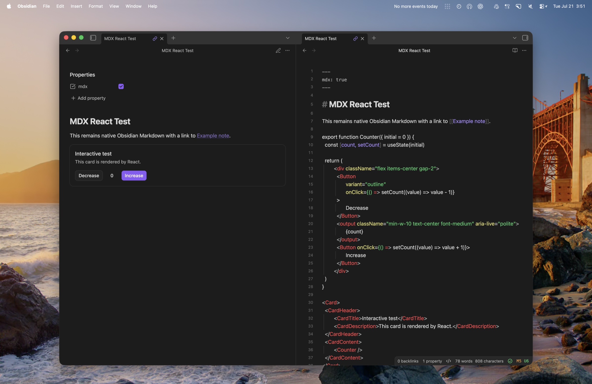

# MDX for Obsidian

MDX renders trusted React components directly inside ordinary Obsidian Markdown notes. Notes remain `.md` files and keep native Properties, links, backlinks, search, graph, Bases, Dataview, embeds, and rename behavior.



This is a private, trusted-vault plugin. It is not currently published in the Obsidian community catalog.

## Trusted-code warning

MDX is executable JavaScript with the privileges of an Obsidian plugin. Only notes whose configured frontmatter property is the boolean `true` execute. Do not opt in downloaded notes, web clips, or content you do not fully trust.

The plugin never fetches code, evaluates remote imports, installs runtime packages, or sends vault content over the network. Static and dynamic imports in notes are rejected. All available components are bundled into `main.js`.

## Use MDX in a note

Add `mdx: true`, then write JSX directly among normal Markdown paragraphs:

```mdx
---
mdx: true
---

# MDX React Test

This remains ordinary Obsidian Markdown with a link to [[Example note]].

export function Counter({ initial = 0 }) {
  const [count, setCount] = useState(initial)

  return (
    <div className="flex items-center gap-2">
      <Button variant="outline" onClick={() => setCount((value) => value - 1)}>
        Decrease
      </Button>
      <output className="min-w-10 text-center font-medium" aria-live="polite">
        {count}
      </output>
      <Button onClick={() => setCount((value) => value + 1)}>
        Increase
      </Button>
    </div>
  )
}

<Card>
  <CardHeader>
    <CardTitle>Interactive test</CardTitle>
    <CardDescription>This card is rendered by React.</CardDescription>
  </CardHeader>
  <CardContent>
    <Counter />
  </CardContent>
</Card>
```



An ordinary note without `mdx: true` is not parsed or executed.

### Local components

Top-level exported functions and constants are available to every inline MDX region in the note:

```mdx
export function LocalGreeting({name}) { return <Badge>Hello {name}</Badge> }

<LocalGreeting name="Reader" />
```

Declarations must use JavaScript syntax accepted by MDX. TypeScript annotations and imports are not supported. Inline regions have independent React roots and state, while exported declarations are compiled into each region that uses them.

### Fenced fallback

Each fenced block has a completely independent compile scope and React root:

````md
```mdx
export function LocalCounter() {
  const [count, setCount] = useState(0)
  return <Button onClick={() => setCount(count + 1)}>Count: {count}</Button>
}

<LocalCounter />
```
````

Fenced blocks also require the note-level frontmatter opt-in.

## Architecture

The plugin deliberately keeps native Obsidian surfaces in charge:

- `.md` plus the boolean frontmatter property `mdx: true` is the only canonical executable-note format.
- Ordinary Markdown is rendered by Obsidian, not React. Only MDX regions are replaced in memory and mounted as React roots.
- Reading view uses a small guarded bridge around `MarkdownPreviewView.prototype.set` and `get`; all private API access is isolated in `src/reading/reading-view-bridge.ts` and restored on unload.
- Live Preview uses an official CodeMirror 6 extension and decorations. It does not patch the editor renderer.
- Fenced `mdx` blocks use Obsidian's official Markdown code-block processor lifecycle.
- The compiler, React runtime, shadcn catalog, and icon catalog are loaded only after an opted-in region needs them.
- Each mount owns its compiler request, React root, Shadow DOM surface, portal container, and cleanup path.

The detailed rationale and compatibility boundaries are recorded in [docs/design.md](docs/design.md).


## Native Reading view

The plugin does not create a custom view or leaf. For an opted-in note, a guarded bridge transforms only in-memory Reading-view input:

1. MDX declarations and JSX regions become temporary HTML placeholders.
2. Obsidian's native Markdown renderer renders everything else, including wikilinks, callouts, embeds, and postprocessors.
3. Lifecycle-managed `MarkdownRenderChild` instances mount React into the placeholders.
4. Each React root and its overlay portal mount inside a lifecycle-managed Shadow DOM surface.
5. Switching notes, closing panes, or disabling the plugin unmounts roots and clears their shadow surfaces.

The original source is retained separately and returned by Reading view's `get()` method, so transformed text cannot be saved to the vault. If the bridge shape is unsupported or parsing fails, the plugin fails open and leaves raw source visible.

## Live Preview

A CodeMirror 6 extension replaces MDX regions with React widgets while the cursor and selection are outside them. Select a non-interactive part of a rendered component to reveal its exact source for editing. Controls such as buttons, inputs, and sliders remain interactive; hold **Option/Alt** while selecting a control to edit its source instead. **Arrow Down** and **Arrow Up** enter an adjacent rendered block instead of skipping it. Local JavaScript declarations appear as a “Local MDX component definition” badge; select the badge to reveal and edit the declaration. Decorations never modify the document, and destroyed widgets unmount their React roots.


Obsidian's normal Live Preview code-block lifecycle handles fenced `mdx` blocks independently.

## Bundled components

The registry includes React, common hooks, and every component module emitted by the current shadcn `b0` Base UI catalog (60 modules). This includes Card, Button, Tabs, Slider, Dialog, Popover, Tooltip, Select, Accordion, Alert Dialog, Drawer, Sheet, menus, Combobox, Command, Calendar, Carousel, Chart, form controls, Sidebar, Sonner, and the remaining layout/data primitives. Demo and domain-specific components are intentionally defined in notes rather than bundled by the plugin.

The bundled `Recharts` namespace supplies the primitives composed by shadcn charts without requiring imports in a note. For example:

```mdx
export function ExampleChart() {
  const { Bar, BarChart, XAxis } = Recharts
  const data = [{ month: "Jan", value: 120 }, { month: "Feb", value: 180 }]
  const config = { value: { label: "Value", color: "var(--chart-1)" } }

  return (
    <ChartContainer config={config} className="h-56 w-full">
      <BarChart accessibilityLayer data={data}>
        <XAxis dataKey="month" />
        <ChartTooltip content={<ChartTooltipContent />} />
        <Bar dataKey="value" fill="var(--color-value)" radius={4} />
      </BarChart>
    </ChartContainer>
  )
}
```

This supports the complete browser-compatible Recharts API through `Recharts.*`; the shadcn `ChartContainer`, `ChartTooltip`, `ChartTooltipContent`, `ChartLegend`, and `ChartLegendContent` helpers remain available directly.

The complete Lucide catalog is available dynamically by name. `Icon` accepts Lucide kebab-case names and shadcn-style component names, while `DynamicIcon` exposes Lucide's raw component and `lucideIconNames` exposes the searchable name list:

```mdx
<Icon name="camera" />
<Icon name="CirclePlusIcon" />
<Button><Icon name="sparkles" data-icon="inline-start" />Illustrate</Button>
```

Unknown names render an accessible question-mark fallback. All icon modules are bundled locally into `main.js`; rendering an icon never fetches code or requires a server. This intentionally increases bundle size in exchange for allowing trusted agents to choose any Lucide icon while authoring a note.

Tailwind preflight and component utilities are embedded in `main.js` and installed only inside each MDX shadow root. Obsidian theme selectors cannot override component internals, while semantic shadcn tokens still resolve through inherited Obsidian CSS variables. Because browsers ignore Tailwind's `@property` declarations inside Shadow DOM, the runtime installs only those non-visual custom-property registrations in the owning document; borders, rings, shadows, and transforms then work inside the isolated surface. The runtime also mirrors light/dark theme state and text direction into each surface.

Overlay components are adapted to portal into a container inside the same shadow root. The surface is created from the rendered host's `ownerDocument`, which keeps dialogs, menus, popovers, selects, and tooltips isolated in the correct Obsidian pop-out window.

Components are source under `src/components/ui/` and exported through `src/components/registry.ts`. To update the catalog, use the shadcn CLI during development, review the generated changes, reapply the portal-container adaptation where needed, and bump `COMPONENT_REGISTRY_VERSION`.

The Base UI Slider uses a scalar for one thumb (`value={rate}`) and an array only for ranges or multiple thumbs (`value={[minimum, maximum]}`). Its change callback returns the same corresponding shape.

The shadcn documentation entries called Data Table and Date Picker are composition recipes rather than standalone catalog modules. Legacy Toast is represented by Sonner. Typography is documentation markup rather than a generated component module.

### Obsidian compatibility adaptations

Generated shadcn source stays close to upstream, with a small set of isolated browser-host adaptations:

- Overlay portals target the owning MDX Shadow DOM surface and `ownerDocument`, including pop-out windows.
- Tailwind styles are embedded inside the Shadow DOM while required `@property` registrations are reference-counted in the owning document.
- Semantic shadcn tokens map to Obsidian theme variables; no Tailwind runtime is shipped.
- Base UI's single-thumb Slider exposes a scalar value while multi-thumb ranges retain arrays.
- Base UI Select disables selected-item-over-trigger positioning and opens below, start-aligned to its trigger. This avoids the specialized alignment path that is unreliable inside an isolated note surface.
- Every Lucide icon and the Recharts namespace are injected locally into MDX scope, so notes do not need imports.

See [examples/mdx-preview.md](examples/mdx-preview.md) for a self-contained 01/02 showcase adapted from shadcn’s Create previews, [examples/component-gallery.md](examples/component-gallery.md) for the catalog gallery, and [examples/mdx-react-test.md](examples/mdx-react-test.md) for the focused native-Markdown proof.

## Settings

- **Enable inline MDX** — defaults to on.
- **Enable fenced MDX blocks** — defaults to on.
- **Frontmatter property** — defaults to `mdx`.
- **Debug logging** — defaults to off.

The settings page also reports whether the Reading-view bridge was installed.

## Validation

Automated coverage includes frontmatter opt-in, parsing and stable placeholders, import rejection and source locations, compiler caching and invalidation, component-registry scope, React cleanup, Live Preview behavior, isolated styles and portals, shadcn interactions, Select positioning mode, Lucide icons, and real Recharts mounts.

The core proof and expanded component note were exercised during development in Obsidian 1.13.2 on macOS in both Reading view and Live Preview. The repository does not claim a complete mobile, pop-out-window, or cross-version manual matrix yet.

## Build and development

Development requires Node.js 20 or newer and npm.

```bash
npm install
npm test
npm run lint
npm run build
```

The build compiles Tailwind and shadcn styles into an internal stylesheet embedded in `main.js`, type-checks strict TypeScript, and bundles browser-compatible runtime code with esbuild. The public `styles.css` contains only the small host, editor-badge, and fallback-error styles needed outside Shadow DOM. The installed plugin needs only `main.js`, `manifest.json`, and `styles.css`. It never needs Node.js, npm, `node_modules`, a React server, or an internet connection.

For manual testing, copy those three artifacts into:

```text
<Vault>/.obsidian/plugins/obsidian-mdx/
```

Reload Obsidian and enable **Settings → Community plugins → MDX**.

## Current limitations

- The Reading bridge patches `MarkdownPreviewView.prototype.set` and `get`. It was inspected against Obsidian 1.13.2 and is guarded by method-shape checks, but private renderer changes may require an update.
- Experimental `.mdx` files are a possible future extension; `.md` plus explicit frontmatter is the only supported canonical format.
- External ESM imports, TypeScript syntax in notes, runtime package installation, and remote code are intentionally unsupported.
- Markdown inside a JSX region follows standard MDX rules. Keep Obsidian-specific wikilinks and callouts outside JSX when native Obsidian rendering is required.
- The full shadcn catalog increases the bundled JavaScript and CSS size. Compiler and registry initialization are deferred until an opted-in note actually renders.
- Browser-oriented components are bundled; server-framework features and server components are not.
- Inline regions are separate React roots. They can share top-level declarations, but not hook state or React context unless composed into the same region.
- Tailwind scans plugin source and checked-in examples at build time. A note can use bundled shadcn styles and generated utilities, but arbitrary new Tailwind class names written after the plugin build may not have corresponding CSS.
- Comprehensive mobile, pop-out-window, accessibility, and light/dark visual regression testing remains manual.

## Possible next steps

1. Add a repeatable manual compatibility matrix for new Obsidian desktop and mobile releases, including pop-out windows, pane switching, reload, and plugin disable/enable cycles.
2. Add a guarded bridge compatibility probe or integration fixture for more Obsidian versions so private API drift is detected before installation.
3. Profile very large notes and make viewport parsing and decoration updates more incremental where measurements justify it.
4. Improve local compile/runtime diagnostics with richer code frames and more precise multi-region source mapping.
5. Add an explicit build-time extension API for private component registries without enabling runtime package installation or remote imports.
6. Add release automation that validates versions and packages only `main.js`, `manifest.json`, and `styles.css`.
7. Consider experimental `.mdx` support only as an optional extension; `.md` plus `mdx: true` should remain canonical.
