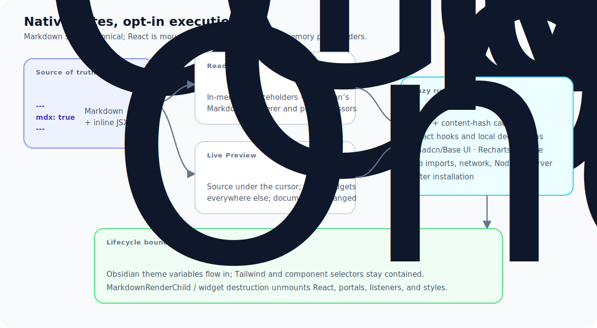
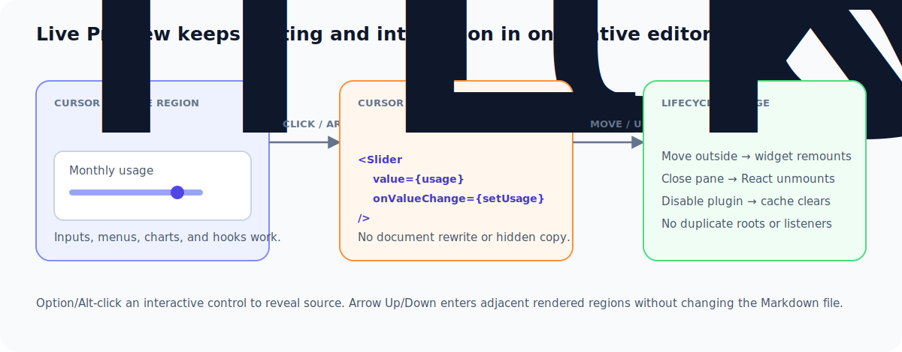

# Design decisions

This document records the architectural choices that are easy to lose when only reading individual implementation files. The plugin is intentionally optimized for a private, trusted vault while preserving Obsidian's native note model.

## Canonical note format

Executable notes remain `.md` files and opt in with a configurable frontmatter property whose value must be the boolean `true`.

This preserves Properties, Bases, Dataview, backlinks, search, graph indexing, embeds, and file-renaming behavior. JSX-looking text is never sufficient to enable execution. Experimental `.mdx` support may be added later, but it must not weaken the `.md` path.

## Native surfaces own Markdown

The plugin does not register an `ItemView`, leaf type, or parallel viewer.

In Reading view, `src/reading/reading-view-bridge.ts` guards and temporarily transforms only the source passed into `MarkdownPreviewView.prototype.set`. MDX-only regions become placeholders; ordinary Markdown continues through Obsidian's renderer and postprocessor pipeline. The paired `get` patch returns the original source so transformed text cannot be persisted. Both methods are restored on unload.

This is the only private Obsidian seam. Unsupported method shapes fail open to raw source, and bridge status is exposed in settings.

Live Preview is independent of the Reading bridge. A CodeMirror 6 extension creates replacement widgets outside the selection and reveals source when the selection overlaps a region. Fenced blocks use `registerMarkdownCodeBlockProcessor("mdx", ...)` and Obsidian-managed children.

## Execution and trust boundary

MDX is trusted local JavaScript with plugin-level privileges. The compiler rejects static and dynamic imports. There is no runtime package manager, CDN, fetched module, server renderer, or Node/Electron dependency.

React, hooks, shadcn components, Recharts, and Lucide are injected through a versioned registry. Demo and domain-specific components stay in notes instead of becoming plugin globals. Top-level exported declarations are compiled into every region that references them. Each region otherwise has an independent React root and state scope.

Compilation is cached by file path, registry version, and content hash. File modification invalidates the path; plugin unload clears the entire compiler and note cache.

## Lifecycle ownership

Every mounted region has exactly one lifecycle owner:

- Reading placeholders and fenced blocks use `MarkdownRenderChild`.
- Live Preview uses CodeMirror widget `destroy()`.
- `NoteRuntime` owns compiler requests and active mounts.
- `createMdxShadowSurface` owns isolated styles, document-level property registrations, theme/direction mirroring, and the overlay container.
- Disposal unmounts React before the surface and its subscriptions are removed.

The implementation prefers multiple small roots because Obsidian renders and unloads note sections independently. A single note-wide runtime with portals remains a possible optimization if future profiling shows a material benefit.

## Styling and component catalog

The complete applicable shadcn Base UI catalog is checked in as source and bundled. Tailwind v4 compiles at build time; the installed plugin ships no Tailwind runtime. Component styles live inside each Shadow DOM surface so Obsidian selectors cannot accidentally restyle component internals. Semantic tokens resolve to inherited Obsidian variables for light/dark compatibility.

Overlay components portal into the same isolated surface and use the host element's `ownerDocument`, which is required for Obsidian pop-out windows. Generated components are kept close to upstream, with narrow adaptations for the portal target, Base UI Slider value shape, and Select placement.

The full Lucide catalog and Recharts namespace intentionally trade bundle size for agent-friendly authoring without imports. Compiler and registry initialization remain lazy so ordinary notes and plugin startup do not pay the runtime cost.

## Failure behavior

The plugin must never blank Reading view or make unrelated notes unusable. Parsing, compilation, runtime, and private-bridge failures are contained to the opted-in region where possible. Errors render near their source with concise locations. Debug output is disabled by default and controlled through settings.

## Compatibility risks

- `MarkdownPreviewView.prototype.set` and `get` are private Obsidian APIs and may change.
- Browser behavior for Shadow DOM, constructable stylesheets, portals, and floating overlays can vary across Obsidian's desktop and mobile WebViews.
- Large notes with many independent regions can create many compilers requests and React roots, although heavy initialization and compilation are cached.
- Tailwind utilities are finite build output. Utilities absent from plugin source and checked-in examples may not exist for arbitrary future note classes.
- Some shadcn entries are framework recipes rather than client-only components and are therefore documented as exclusions.

## Recommended next work

The highest-value follow-up is compatibility automation: a repeatable manual matrix plus a small integration harness for Reading view, Live Preview, pop-out windows, and unload behavior across supported Obsidian versions. Performance work should follow measurement on real large notes. Registry extension and richer diagnostics are useful after compatibility is stable; remote execution and runtime installation should remain out of scope.
